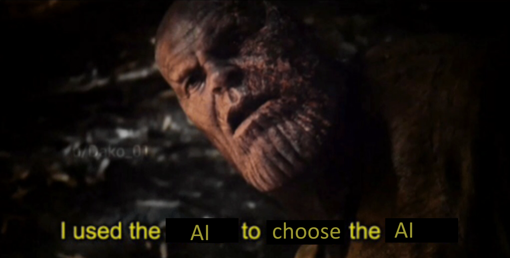

# Overlord AI
For a version with clickable links and images, see [my GitHub](https://github.com/CoenBeemer/AI/blob/personalProject/doc/README.md).

## What does this project aim to do?
Oh no! You mixed up your low-res cat images dataset with your poorly formatted wages dataset! 

If only there was an AI that you could throw this mess into that would pass on the cat images to an AI upscaler and the dataset to a wages predictor AI!

No worries, OverlordAI is here to help. It will choose a suitable existing AI from this list (insert link to list here) to process your data!

The idea behind this AI is to find a suitable AI for a large amount of datasets with varying and/or unknown data types. 

## Why "Overlord" AI?
The name "Overlord AI" came from the idea of having one AI rule over several others, making them the ruler or "overlord".

## Why use Overlord AI?
This AI can be used to:
- Help people with little to no knowledge about AI explore existing AI "Throw everything against the wall and hope something will stick" style.
- Help people who are somewhat more experienced with AI find a suitable AI for their data easier and faster

## How to get started
click run I guess, I have no clue since at this point I haven't written a single line of code.

## Where to get help
Ever heard of stackOverflow? Good luck.

If you can't figure it out with stackOverflow's help, you can contact one of the project [maintainers](#current-maintainers-for-this-project)

## Cost estimate

The estimated cost of this project without hourly wages would be free, as (for now) there are no plans of using licensed/closed source AI solutions.

Since there are [platforms](https://modelzoo.co/) with a lot of open source pretrained AI models, there is no need to spend money on super niche and expensive AI models.

## Maintainers & project status
### Current maintainers for this project
 - [Coen Beemer](maintainers/CoenBeemer.md)

### Current project goals & status
* [x] <mark style="color:red;">Concept</mark>
* [x] <mark style="color:orange;">Project Proposal</mark>
* [ ] <mark style="color:yellow;">AI gathering</mark>
* [ ] <mark style="color:yellow;">Data gathering</mark>
* [ ] <mark style="color:yellow;">Model training</mark>
* [ ] <mark style="color:green;">Model validation & documentation</mark>
* [ ] <mark style="color:green;">AI choosing AI</mark>

### Stretch goals:
* [ ] <mark style="color:green;">Multiple datatypes</mark>
* [ ] <mark style="color:green;">Hyperparameter tuning</mark>

### Planning:
| Phase\Week        	| 1 	| 2 	| 3 	| 4 	| 5 	| 6 	| 7 	| 8 	| 9 	| 10 	| 11 	| 12 	| 13 	| 14 	| 15 	| 16 	| 17 	| 18 	| 19 	| 20 	|
|-------------------	|---	|---	|---	|---	|---	|---	|---	|---	|---	|----	|----	|----	|----	|----	|----	|----	|----	|----	|----	|----	|
| Concept creation  	| x 	| x 	| x 	|   	|   	|   	|   	|   	|   	|    	|    	|    	|    	|    	|    	|    	|    	|    	|    	|    	|
| Project proposal  	|   	|   	| x 	| x 	|   	|   	|   	|   	|   	|    	|    	|    	|    	|    	|    	|    	|    	|    	|    	|    	|
| AI/Data gathering 	|   	|   	|   	| x 	| x 	| x 	| x 	|   	|   	|    	|    	| x  	| x  	| x  	|    	| x  	| x  	|    	|    	|    	|
| Model training    	|   	|   	|   	|   	|   	|   	| x 	| x 	| x 	| x  	|    	|    	| x  	| x  	| x  	|    	| x  	| x  	|    	|    	|
| Model validation  	|   	|   	|   	|   	|   	|   	|   	|   	|   	| x  	| x  	|    	|    	|    	|    	|    	|    	|    	|    	|    	|
| Documentation     	|   	|   	|   	| x 	| x 	| x 	| x 	| x 	| x 	| x  	| x  	| x  	| x  	| x  	| x  	| x  	| x  	| x  	| x  	| x  	|
| Finishing up      	|   	|   	|   	|   	|   	|   	|   	|   	|   	|    	|    	|    	|    	|    	|    	| x  	| x  	| x  	| x  	| x  	|
| Stretch goals     	|   	|   	|   	|   	|   	|   	|   	|   	|   	|    	|    	|    	|    	|    	| x  	| x  	| x  	| x  	|    	|    	|

## Sources
### Datasets
A list of all the used datasets and their sources can be found [here](../data/datasets/SOURCES.md).
### AI models
A list of all the used AI models and their sources can be found [here](../data/models/SOURCES.md)
### Resources
A list of all the used resources can be found [here](RESOURCES.md)
