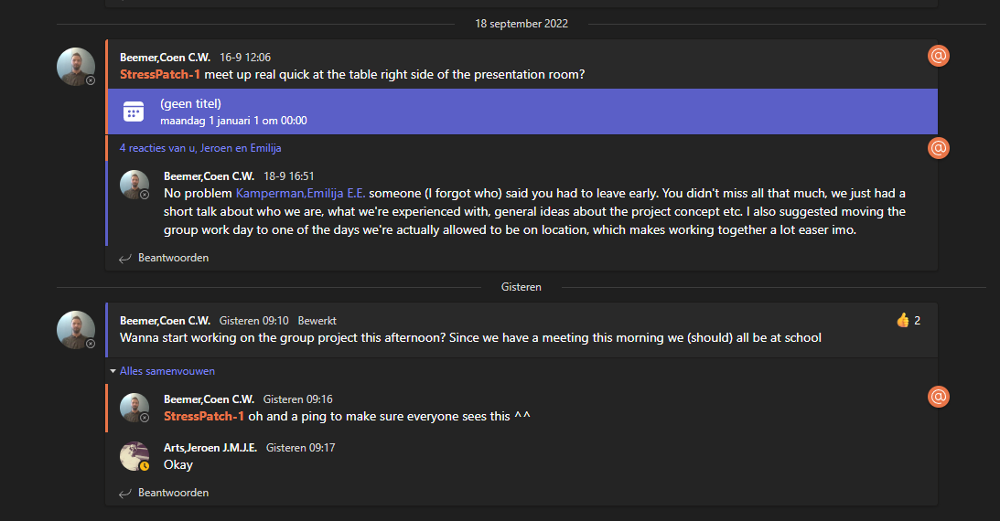

# ☑ LO5

## Learning outcome description

The student can display the data in a way which is useful and/or interesting to the target group.

## Self-assessment

* [x] <mark style="color:red;">Undefined</mark>
* [x] <mark style="color:orange;">Orienting</mark>
* [x] <mark style="color:yellow;">Beginning</mark>
* [x] <mark style="color:green;">Proficient</mark>
* [x] <mark style="color:green;">Advanced</mark>

## Learning Process

### First Evaluation: Week 7

I made several data visualisations for the data gathered from the web scraping. I made several bar graphs and boxplots in an attempt to figure out relations in the data which my AI could use as indicators for certain datatypes. My data is a bit skewed, as my data has been filtered on one of these tags (I think you can guess which one).

<figure><figcaption></figcaption></figure>

#### Self Assessment: Orienting

### Third Evaluation: Week 10

As explained in [LO2 week 10](lo2.md#second-evaluation-week-10) I made several visualizations for my personal project to see if there is any correlation in the data. I initially started with making scatter plots such as this one:&#x20;

<figure><figcaption>
A scatter plot for trying to figure out if the game score is related to release dates somehow
</figcaption></figure>

However this didn't show much correlation so I tried adding more features like this:&#x20;

<figure><figcaption>
That same scatter plot but with age rating as added feature
</figcaption></figure>

This didn't help much either though, which is why Georgiana recommended looking into correlation matrices. This did help somewhat, though not much because I have so many features which causes the resolution to become an issue:

<figure><figcaption>
A correlation matrix of almost 2000 features
</figcaption></figure>

As you can see there are some dots spread around which indicates correlation, but with the sheer amount of features (almost 2000) there is no way of telling what is what. Because of this, I decided to split up the features into smaller blocks(of about 200) which will give a much clearer image of where significant data can be found. This image for example shows a clear hotspot around the resolution features:

<figure><figcaption>
A correlation matrix of about 200 features with a clear hotspot in the top right
</figcaption></figure>

#### Self Assessment: Beginning (almost proficient)

### Fourth Evaluation: Week 16

As seen in [LO4 week 13](lo4.md#fourth-evaluation-week-13) I have improved my data visualisations by adding on timestamps instead of a measurement index. I've also improved the other visualizations by adding a legend and improving the readability.

<figure><figcaption>
A graph of the sensor values and stress levels over time
</figcaption></figure>

<figure><figcaption>
A visualization of the model's predicted values against the expected values
</figcaption></figure>

#### Self Assessment: Proficient

### Fifth Evaluation: Week 16

To get this learning outcome to advanced, I decided to do some exploring on the group project datasets. For this, I decided to use PowerBI, as this is a well-known tool for data visualization.&#x20;

First, I imported all of the datasets to look at, but as the formatting of the original file was quite annoying I decided to combine all datasets into one file for easier access. I did this in excel by copying over all the significant information (sensor values) while leaving out the insignificant information (dates and time of the experiments) I converted the timestamps into relative values from the start of the experiment instead to keep track of measurement duration etc.

<figure><figcaption></figcaption></figure>

I then made some graphs to visualize the data so I could see what I was working with. Sadly, some of the measurements contain **very** big outliers, which is why I used the zoom function to zoom in on the significant data while ignoring the outliers. This can also be solved by using filters, but as this is data exploration I believe it is better to let the data go out of frame instead of filtering out very high values. From these graphs I was able to establish some expected value ranges, being 0-12 uS for SkinConductance and 0-4000 kOhms for skinResistance. I believe any data outside of those ranges are caused by sensor errors or other external factors causing wrong measurements. By looking at this big pile of graphs I was able to conclude not all datasets may be suitable for use, as for example the pink line in the first graph is clearly flatlined for most of the duration of the measurements.

<figure><figcaption></figcaption></figure>

&#x20;After getting a general idea of the full data, I decided it was a good idea to look into a bit more detail on each set of measurements. For this, I made a template which I used to graph out every individual set of measurements.

<figure><figcaption></figcaption></figure>

By looking at which measurement sets were very wrong I was able to filter out several datasets which do not follow the expected pattern or datasets with very wrong measurements such as for example these:&#x20;

<figure><figcaption>
Measurements that are very noisy and way out of the expected values
</figcaption></figure>

<figure><figcaption>
No clear pattern with random peaks unrelated to the experiments
</figcaption></figure>

<figure><figcaption>
This dataset starts off alright, but has too much noise and at some point just flatlines.
</figcaption></figure>

A good dataset would look like this for example:&#x20;

<figure><figcaption>
An example of a good dataset: not too much noise and a clear pattern.
</figcaption></figure>

These measurements clearly show increases at times where the experiment could induce stress. The data also does not have a lot of noise, as the lines are pretty smooth when not being influenced by the experiment. Because of this, I believe this dataset could work well when making an AI model.

The first thing I noticed was the measurements are pretty much mirrored but measured in different ranges. This is because of what the measurements are: conductance and resistance. These are the exact opposite of one another, so when one goes up the other goes down. According to [wikipedia](https://en.wikipedia.org/wiki/Electrical\_resistance\_and\_conductance):

<figure><figcaption></figcaption></figure>

This means that either sensor is practically measuring the same, as they can be interchanged if the right formula is used.

The data also contains edge cases like this one:

<figure><figcaption>
Sensor data where the patch was removed before stopping measurements
</figcaption></figure>

In this dataset there is still a clear pattern and not much noise, but at the end the values spike/crash because the patch was removed before measurements were stopped. This does distort the data, but this can be solved by removing the last several measurements. I did this by adding filters.

<figure><figcaption>
Filter settings to remove the wrong measurements
</figcaption></figure>

<figure><figcaption>
After processing this data looks a lot more usable
</figcaption></figure>

I believe I have shown this learning outcome at an advanced level by using this professional tool to generate visualizations from which I was able to make decisions on which datasets to (not)use for the group project. The files for this data exploration can be found [here](https://github.com/CoenBeemer/AI/blob/v2/data/DataExploration.pbix).

#### Self Assessment: Advanced
