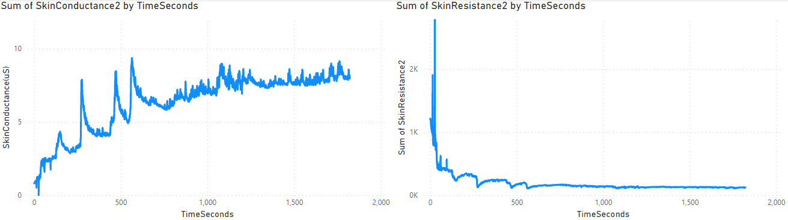

# Personal retrospective log

## Week 1 & 2: start-up

In my opinion this was a REALLY slow start. I understand people from outside FHICT need a couple days to get used to the way stuff works, but we were left pretty much without guidance which led to a lot of people doing nothing during the group project concept phase. From what I could tell this week should have been group brainstorming about ideas for both personal and group project ideas, but no groups were made nor did we get any templates/examples for project proposals.

I also learned we'll only be told about the PDR in week 3, which is very late in my opinion, as during the first couple weeks we should still document in the PDR what we did, which can show a certain baseline for some of the learning outcomes.&#x20;

#### Teacher feedback

I talked to multiple teachers about my personal project concept, and most of them seemed interested in it. \
Kazimier said it was an unique idea and according to Danny it was a realistic concept for which he had a couple ideas which I could expand on. Coen also expressed his interest in the technological aspect of working with many different data types.

<figure><figcaption>
feedpulse feedback
</figcaption></figure>

## Week 3: PDR & making groups

During this week I focussed on setting up this PDR and making groups. We did have some workshops, which seemed somewhat out of order going from really basic beginner level to hard & advanced stuff and back to beginner again. I did learn a couple things from the workshops, but they didn't really help with giving direction to my personal project just yet.

## Week 5: Ball starts rolling

This week the group project started going somewhere, we made the project proposal and I got some extra advice on how to approach my personal project. In my opinion progress is still very slow, and having very few people working at TQ is kind of demotivating to me.

### Teacher feedback

I talked to Hans and Georgiana, both of which were interested in what I was aiming for. Georgiana helped define some smaller steps I could take to achieve my goal, starting with data gathering _while_ showing multiple other learning outcomes. I'll do this by running existing algorithms and then putting the output in a separate dataset so they can be referenced for future runs of my own AI. Hans suggested combining multiple datasets from a single theme as well, which I don't think is _as_ relevant to my project but can still be interesting to take a look at.

<figure><figcaption>
feedpulse feedback
</figcaption></figure>

<figure><figcaption>
Georgiana's illustration of my AI's layout
</figcaption></figure>
